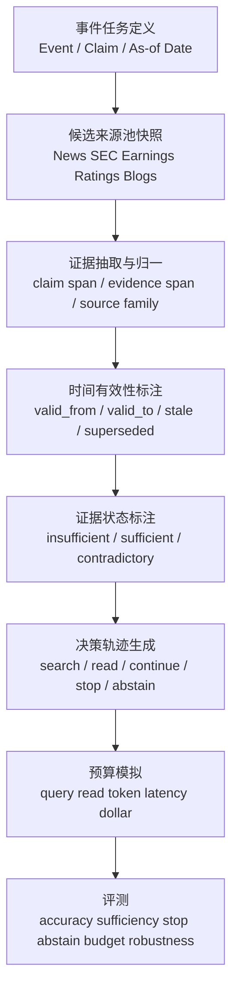

# Event Evidence Controller 相关开源 benchmark 调研报告

## Executive Summary

在你给定的严格口径下——时间窗口限定为 2025-06-24 至 2026-06-24，只纳入 NeurIPS/ICLR/ICML/EMNLP/EACL/WWW/KDD/ACL/AAAI 等顶会正式发表或已在论文页明确标注接收，且代码/数据当前可访问——我最终只找到 **一个“严格合格”的 benchmark：LiveResearchBench**。它是目前最接近“开放网页、多源搜索、长报告评测”的正式开源基准，但它的任务中心仍然是 **deep research 报告质量**，而不是你们真正需要的 **事件级证据获取、证据充分性控制、停止/弃答、预算最优化**。citeturn48view0turn48view3turn48view4

另外有两类工作非常接近你们的问题：一类是 **benchmark 近似项**，例如 OverSearchQA 与 Fin-RATE；另一类是 **方法近似项**，例如 Search Wisely 与 DAS，它们分别把“过度搜索 / 欠搜索”和“decision boundary / sufficiency stop”推得很近。问题在于：前者要么当前会话中无法独立验证官方开源页，要么不满足正式顶会发表；后者虽然能给出任务定义与训练方法，但本身不是你要的 benchmark。citeturn32view2turn13view0turn42academia0turn45view0turn47view0

因此，一个非常明确的结论是：**学界到 2026-06 仍没有一个正式、开源、顶会级 benchmark，把“事件对象 + 多源证据 + sufficiency state + stop/abstain + time validity + source independence + budget evaluation”完整合并成统一任务。** 这既是空白，也是你们最有价值的切入点。citeturn48view0turn32view2turn42academia0turn38view0turn30view0

## 筛选口径与结论

本报告采取四层筛选：第一层看时间是否落在 2025-06-24 至 2026-06-24；第二层看是否为你指定顶会正式发表，或至少在论文页 comments / journal reference 中明确标注已被对应顶会主会接收或收入 proceedings；第三层看是否有 **当前可访问** 的官方代码页与/或官方数据页；第四层看任务是否与 **Event Evidence Controller / Budgeted Event Evidence Acquisition and Sufficiency Control** 足够相关。按这个标准，**严格合格项只有 LiveResearchBench**。Over-Searching 论文页明确写明 EACL 2026 Main Conference，并声明发布 OverSearchQA，但我在本轮可访问页面中未独立定位到官方代码/数据页；Fin-RATE 可以验证 KDD ’26 的正式 proceedings/journal reference 与 benchmark 内容，但本轮也未独立检出其官方代码/数据页，因此这两项不纳入“严格合格主表”，只放入补充表。citeturn48view0turn48view3turn48view4 citeturn32view2turn43view2 citeturn13view0turn42academia0

更重要的是，即使把补充项也算进来，现有基准仍然都没有把你们关心的七个核心维度一起建模：**主动搜索、事件对象、证据状态、时间有效性、来源独立性、停止/弃答、预算评测**。LiveResearchBench 覆盖 live open-web 与长报告；OverSearchQA 更接近 stop/over-search；Fin-RATE 更接近时间与跨文档分析；TaxoBench 更接近“找全并组织”；DeepSearchQA 更接近开放式穷举、去重与停止标准。但没有哪个 benchmark 同时把这些维度拉满。citeturn48view0turn32view2turn42academia0turn38view0turn30view0

## 严格合格 benchmark 主表

### 严格合格 benchmark 一览

| benchmark | 论文 | 会议 | 发表时间 | 开源地址 | 任务定义 | 覆盖维度 | 与你们需求的差距 | 证据 |
|---|---|---|---|---|---|---|---|---|
| LiveResearchBench | *LiveResearchBench: A Live Benchmark for User-Centric Deep Research in the Wild* | ICLR 2026 | 论文页标注 Accepted to ICLR 2026；数据与代码于 2025-10 起公开 | 官方 GitHub + Hugging Face 数据页均当前可访问 | 输入是 100 个 user-centric、dynamic、multi-faceted 的 live open-web 深调研任务；输出是 citation-grounded long-form report；评测由 DeepEval 完成，覆盖 coverage、presentation、citation accuracy / association、consistency、analysis depth 等 | 主动搜索 ✓；事件对象 ✗；证据状态 ✗；时间有效性 ◐；来源独立性 ✗；停止/弃答 ✗；预算评测 ✗ | 它评的是“深调研报告是否好”，不是“围绕事件主动采证并判定证据是否足够”；没有显式 sufficiency state、stop/abstain label、source-family independence 或预算协议 | citeturn48view0turn48view3turn48view4 |

### 覆盖维度对比矩阵

下表把 **严格合格项** 与 **高相关补充项** 放在一张矩阵里，方便你判断研究缺口应该在哪里开。补充项不算入“严格合格 benchmark 数量”。相关维度来自论文或官方数据/仓库卡片的可验证描述。citeturn48view0turn32view2turn42academia0turn38view0turn30view0

| 项目 | 严格状态 | 主动搜索 | 事件对象 | 证据状态 | 时间有效性 | 来源独立性 | 停止/弃答 | 预算评测 | 关键差距 |
|---|---:|---:|---:|---:|---:|---:|---:|---:|---|
| LiveResearchBench | 严格合格 | ✓ | ✗ | ✗ | ◐ | ✗ | ✗ | ✗ | long-form deep research 强，但没有 event-level sufficiency control citeturn48view0turn48view3 |
| OverSearchQA | 补充 | ✓ | ✗ | ✗ | ✗ | ✗ | ◐ | ✓ | 明确打到 over-search / abstention / efficiency，但不是事件对象，也没有 source independence citeturn32view2turn43view2 |
| Fin-RATE | 补充 | ✗ | ◐ | ✗ | ✓ | ✗ | ✗ | ✗ | 强时序、跨公司、跨文档分析，但不是开放搜索与 stop control benchmark citeturn13view0turn42academia0 |
| TaxoBench | 补充 | ◐ | ✗ | ✗ | ✗ | ✗ | ✗ | ✗ | 强在 retrieve + organize 的双层诊断，但不是事件证据与 sufficiency 任务 citeturn38view0turn39view0turn51view0 |
| DeepSearchQA | 补充 | ✓ | ✗ | ✗ | ✗ | ✗ | ◐ | ✗ | 贴近开放式穷举与 stopping，但无正式顶会发表验证，且不是事件中心 benchmark citeturn30view0turn52view0 |

## 补充 benchmark 与方法信号

### LiveResearchBench 的公开实现、指标与实验信号

LiveResearchBench 的官方仓库把 benchmark 与 DeepEval 一起发布。任务规模为 **100 个 expert-curated 实时网页任务**，覆盖日常生活、企业和学术三类场景；DeepEval 则把评测拆成五类：**Presentation & Organization、Factual & Logical Consistency、Coverage & Comprehensiveness、Analysis Depth、Citation Association**。仓库 README 明确说明其设计目标是“需要 extensive, real-time web search, multi-source reasoning, and cross-domain synthesis”，而不是单点事实问答。citeturn48view3turn48view4

它的关键方法价值不在检索算法，而在 **评测协议设计**：不同维度采用不同 judge protocol，而不是单一总分；同时 benchmark 与评测器共同开源，使得“生成 long-form report”与“评价 long-form report”可以一起复现。论文页与仓库页都说明作者用它评了 **17 个 frontier deep research systems**。但在你们的问题上，它最大的不足也同样明显：**没有事件对象标注，没有 source-family independence，没有显式 sufficiency state，也没有 stop / abstain / budget 的黄金协议**。citeturn48view0turn48view3turn48view4

### 高相关但未进入严格主表的 benchmark 近似项

**OverSearchQA / Over-Searching in Search-Augmented Large Language Models** 最接近你们的 “Evidence Controller” 侧任务。论文页明确写出：它系统评估 over-search，提出 **Tokens Per Correctness (TPC)** 这类把性能与成本绑定的指标，并且指出 negative evidence 有助于 abstention；comments 中标明已被 **EACL 2026 Main Conference** 接收。问题是，在本轮可访问页面里我只能验证“论文与 release 声明”，没有独立定位到当前可访问的官方代码/数据页，所以它不能算本报告中的“严格合格开源 benchmark”。从需求匹配度看，它在 **是否继续搜、是否该停、成本—正确性权衡** 上非常重要。citeturn32view2turn43view2

**Fin-RATE** 则是你们在“时间有效性、跨文档比较、跨实体跟踪”上的最强近邻。论文页给出 journal reference / proceedings 信息，表明它进入 **KDD ’26**；摘要说明 benchmark 构建在 SEC filings 上，并把任务拆成 disclosure 内细节推理、cross-entity comparison、longitudinal tracking 三条路径。更关键的是，论文摘要给出非常可用的诊断结果：随着任务从单文档转向 longitudinal 与 cross-entity，准确率分别下降 **18.60%** 和 **14.35%**，并出现 time mismatch、entity mismatch、comparison hallucination 等失败模式。它与事件证据控制的差距是：**没有主动开放搜索，没有显式 sufficiency stop，来源类型也比较单一**。citeturn13view0turn42academia0

**TaxoBench** 不满足“顶会正式发表”，但它非常值得你们参考，因为它首次把 deep research 拆成 **retrieve** 与 **organize** 两层，并且给出结构化树评测指标。公开版本包含 GitHub 仓库与 Hugging Face 数据集，数据规模是 **72 个 survey topic、72 棵 expert taxonomy tree、3815 篇 ground-truth cited papers**；评测支持 Deep Research Mode 与 Bottom-Up Mode，两者分别考 end-to-end 检索组织能力与固定材料下的组织能力。它的实验信号很关键：最佳 agent 只召回 **20.92%** 的专家论文，而最强模型的组织对齐仍显著低于人工标注组，说明“组织能力”与“找资料能力”必须拆开测。citeturn38view0turn39view0turn51view0

**DeepSearchQA** 同样不满足“顶会正式发表”，但它在任务定义上非常贴近你们：它是 **900 prompts、17 个领域** 的开放式复杂信息搜集 benchmark，特意强调 **系统性收集、去重 / entity resolution、是否已经可以停止**。摘要直接指出当前 agent 的两个代表性失败：**premature stopping** 与 **hedging through low-confidence answers**。这几乎就是你们要建的 Event Evidence Controller 的缩小版，只是它不是事件对象中心，也没有来源独立性与时间有效性的黄金标注。citeturn30view0

### 方法层面的强信号

如果把 benchmark 与方法分开看，**Search Wisely** 与 **DAS** 是你们最值得借鉴的两篇正式工作。Search Wisely 在 EMNLP 2025 主会中正式定义并量化 over-search / under-search，用 step-wise 分析发现 R1-Searcher 与 Search-R1 分别有 **20.2%** 与 **27.7%** 的搜索步骤其实可以不搜，同时 non-search 步骤中又存在很高的 under-search error；它进一步提出基于搜索查询 token 置信度的 **β-GRPO** 奖励设计，在 7 个 QA benchmarks 上把平均 EM 拉到 **0.344**，比 Search-R1 的 **0.303** 更高。citeturn45view0turn45view1

DAS 则更直接命中你们的研究层表述。WWW 2026 的论文把 **decision boundary** 正式化为“信息是否已经 sufficient to answer”的阈值，并把错误划成 over-search 与 under-search 两类；然后用 **因果干预产生 factual / counterfactual preference pairs**，再用 preference optimization 去校准 policy。论文页明示 WWW ’26 proceedings 信息，并在摘要里给出 GitHub 链接；不过该链接在本轮访问时返回 **404**，所以它可以作为方法信号，但暂时不适合作为你们“依赖其代码的复现基座”。citeturn47view0turn50view0

## 主要 challenge 与产品优先级

现有 benchmark 暴露出的 challenge 至少有下面这些，而且它们刚好对应你们产品与研究的两个层面。

首先，**事件对象缺失** 是最核心的空白。现有 benchmark 多数以 open-ended query、survey topic 或 finance analysis 为主，而不是“某一事件 / 子事件 / claim cluster”的对象级表示。没有 event object，就很难把“证据是否足够”定义成一个可标注、可停止的状态变量。这对你们是 **高优先级**，因为产品端要做的是“每天 4–5 个最该看的事件”，不是泛化 deep research。citeturn48view0turn38view0turn30view0

第二，**证据状态没有 gold label**。LiveResearchBench 评最终报告，OverSearchQA 评过度搜索，Fin-RATE 评跨期分析，TaxoBench 评检索与组织，但几乎都不直接给 “insufficient / weakly sufficient / sufficient / contradictory / stale” 这样的中间证据状态。这对你们研究层是 **高优先级**，因为没有 state label，就无法系统训练 controller 学 “继续搜 / 停止 / 弃答”。citeturn48view0turn32view2turn42academia0turn38view0

第三，**停止与弃答还不是 benchmark 主任务**。OverSearchQA、Search Wisely、DAS 让这个问题浮出水面，但在正式 benchmark 层面仍然大多是“附带分析”，而不是主评测协议。这对产品也是 **高优先级**：你们真正要优化的是“今天给用户看哪四五个事件，并且什么时候不该再搜了”。citeturn32view2turn45view0turn47view0

第四，**来源独立性几乎没有显式标注**。现有基准通常关心 citation accuracy，却很少显式告诉你两条证据是否来自同一家媒体集团、同一新闻社 syndication family、同一公告源的转载链。对事件情报产品来说，这是 **高优先级**，因为“3 条都来自同一条路透稿”的支持强度，和“SEC + 公司公告 + 独立媒体”的支持强度，不应被视为等价。这个维度在现有 benchmark 中基本空缺。citeturn48view3turn48view4

第五，**时间有效性标注不足**。LiveResearchBench 强调 dynamic / realtime，但没有把 evidence 的 validity interval 做成标准黄金标签；Fin-RATE 有强时间性，但局限于 SEC filing 时序；QDET 说明时间线与子事件组织在工业场景里很重要，却不是开放 benchmark。对你们来说这是 **高优先级**，因为金融 / 科技股事件高度依赖 as-of date。citeturn48view3turn42academia0turn41academia2

第六，**预算维度通常单轴化**。OverSearchQA / TPC 把 token 成本拉进评测，是非常重要的一步；但产品真实预算同时包括 query 次数、读文档次数、上下文窗口、延迟、API 成本与失败重试。这对你们研究层是 **高优先级**。单一 token 指标不足以驱动真正可靠的 controller。citeturn32view2turn43view2

第七，**retrieval error、synthesis error、stopping error 没有被系统解耦**。TaxoBench 是少数显式把 retrieve 和 organize 分拆的工作；Fin-RATE 也强调过去 benchmark 很难区分错误来自 retrieval、generation、finance reasoning 或 query/context misunderstanding。你们最需要的是再向前一步，把 **是否继续搜** 单独拆出来。这个挑战对产品和研究都是 **高优先级**。citeturn38view0turn42academia0

第八，**negative evidence / contradiction evidence 的角色被低估**。Over-Searching 明确指出 negative evidence 能改善 abstention；但多数 benchmark 仍默认“证据越多越好”，很少把“相互矛盾、失效、被公告否认、只支持部分 claim”的证据单列成黄金标签。这对你们是 **高优先级**，因为真实事件情报里，经常需要判断“这个说法仍未被证实”。citeturn32view2turn43view2

第九，**长报告 judge 的稳定性仍然是开放问题**。LiveResearchBench 通过 DeepEval 做了很多 protocol engineering，但本质仍是 LLM-as-a-judge 体系；一旦你们把目标换成 event-level controller，就更应该把最终报告得分后撤，更多依赖事件级、claim级、decision级的显式标签。这对你们是 **中优先级**：重要，但可以在 controller benchmark 里通过结构化指标先绕开一部分。citeturn48view3turn48view4

第十，**live web 的现实性与复现性天然冲突**。LiveResearchBench 之所以真实，是因为它 live；但也因此引入 drift。你们如果直接从第一版就做纯实时 benchmark，维护成本会很高。这个问题对产品是 **高优先级**，对首篇论文是 **中优先级**：研究上应该先做 snapshot + replayable benchmark，再补 live track。citeturn48view3turn48view4

## 评测扩展建议

### 面向 Event Evidence Controller 的可复现扩展框架

下面这条扩展路线，是我认为最适合把现有 benchmark 进一步推向你们目标任务的方式。它不是重写一切，而是把 LiveResearchBench 的 open-web realism、OverSearchQA 的 stop/cost intuition、Fin-RATE 的时间性、TaxoBench 的误差拆分、DeepSearchQA 的开放式搜集任务组合在一起。citeturn48view0turn32view2turn42academia0turn38view0turn30view0

### 建议新增的指标、标注与模拟方案

| 扩展项 | 具体做法 | 实现优先级 | 预期难度 | 为什么重要 |
|---|---|---:|---:|---|
| 事件级 gold label | 把任务主对象从 query 改成 `event_id + claim_set + as_of_date`，每个事件含 3–10 条核心 claim | 高 | 高 | 没有 event object，就无法定义 evidence sufficiency |
| 证据状态标注 | 每条 claim 标 `unsupported / partially-supported / supported / contradicted / stale`，再聚合为事件级 sufficiency state | 高 | 高 | 直接支撑 controller 的继续搜 / 停止 / 弃答策略 |
| source-family 标注 | 为每个 URL / 文档分配 `source_family_id`、`source_type`、`ownership_group`，转载链共享 family id | 高 | 中 | 解决“多条证据其实同源”的假独立问题 |
| 时间有效性标注 | 给证据加 `published_at / observed_at / valid_from / valid_to / superseded_by` | 高 | 中 | 金融科技事件强依赖 as-of time |
| stop / abstain 决策标签 | 在轨迹级生成每一步 `continue / stop / abstain` 的最优动作标签，可用人工 + counterfactual replay 混合构造 | 高 | 高 | 这是 Event Evidence Controller 的核心监督信号 |
| budget 模拟器 | 同时记录 query 次数、读取文档数、token、延迟、美元成本，并允许固定预算 / 分层预算两种协议 | 高 | 中 | 避免只优化 token 而不优化真实运营成本 |
| oracle-evidence 对照集 | 对同一任务同时提供 Oracle Evidence split 与 Open Retrieval split | 高 | 中 | 用来拆分 retrieval、sufficiency、synthesis 三类误差 |
| contradiction / negative evidence slice | 专门构造被辟谣、被更新、只部分成立、公告与媒体冲突的事件子集 | 中 | 中 | 非常贴合金融与科技股真实场景 |
| family-diversity 指标 | 在支持度中加入来源独立性惩罚，例如 diversity-weighted support | 中 | 中 | 比“引用条数”更接近真实证据强度 |
| 停止质量指标 | 新增 Stop-F1、Over-search rate、Under-search rate、Marginal-Gain AUC、Abstain calibration error | 高 | 中 | 直接度量 controller 是否知道“够了没” |

这些扩展项里，我最推荐你们先做四个：**事件级 gold label、证据状态标注、source-family 标注、预算模拟器**。这四项一旦存在，Stop / Abstain / Sufficiency 的绝大多数研究问题都可以自然落在 benchmark 上。相反，如果一开始只做长报告评分或只做 live search realism，你们会很难形成真正区分 controller 能力的评测。citeturn48view3turn32view2turn42academia0turn38view0

### 我建议你们优先复用的现有资产

如果要走“最快可复现”的路线，我建议把 **LiveResearchBench 的任务协议与 judge 工程** 作为外层框架，把 **TaxoBench 的层级误差拆分思路** 和 **Fin-RATE 的时间 / 跨文档构造方法** 嵌进去，再用 **Search Wisely / DAS** 的 over-search、under-search、decision boundary 定义去给轨迹打标签。这样你们不需要从零发明全部术语，而是能把已有学术语言拼成一个更强、更像产品真实需求的 formal task。citeturn48view3turn51view0turn42academia0turn45view0turn47view0

## 参考链接

以下优先列可以直接点击的官方论文页、官方代码库、官方数据页；补充项会明确其状态。

- LiveResearchBench 论文页 citeturn48view0
- LiveResearchBench 官方 GitHub citeturn48view3
- LiveResearchBench 官方 Hugging Face 数据页入口来自仓库 README citeturn48view3turn48view4
- Over-Searching in Search-Augmented Large Language Models 论文页（EACL 2026 主会；声明 release OverSearchQA） citeturn32view2turn43view2
- Fin-RATE 论文页与 KDD ’26 proceedings / journal reference 信息 citeturn13view0turn42academia0
- TaxoBench 论文页 citeturn38view0
- TaxoBench 官方 GitHub citeturn39view0
- TaxoBench 官方 Hugging Face 数据集页 citeturn51view0
- DeepSearchQA 论文页 citeturn30view0
- DeepSearchQA Kaggle Leaderboard / benchmark 页面 citeturn52view0
- Search Wisely 论文页（EMNLP 2025 主会） citeturn45view0turn45view1
- DAS 论文页（WWW 2026） citeturn47view0
- DAS 论文中给出的 GitHub 链接当前访问返回 404，可视为“开源链接失效”信号 citeturn47view0turn50view0

| 通用学术任务                    | 考什么          | 代表方向                 |
| ------------------------- | ------------ | -------------------- |
| Browsing Agent            | 找到难找事实       | BrowseComp           |
| Deep Search Agent         | 完整搜索、去重、停止搜索 | DeepSearchQA         |
| Deep Research Agent       | 多源研究报告生成     | DeepResearch Bench   |
| Agentic RAG               | 动态检索决策       | Agentic RAG / A-RAG  |
| Multimodal Evidence Agent | 图文证据绑定与引用    | MMDeepResearch-Bench |

| 金融学术任务                                    | 考什么                 | 代表方向                                                 |
| ----------------------------------------- | ------------------- | ---------------------------------------------------- |
| Financial Search-and-Reasoning            | 金融开放域搜索、时间敏感事实、复杂调查 | FinSearchComp                                        |
| SEC Filing / Financial Document Reasoning | SEC 披露理解、跨公司、跨时期追踪  | Fin-RATE                                             |
| Financial Deep Research Report            | 专业金融研究报告质量          | FinDeepResearch / Deep FinResearch Bench / ICBCBench |
| Financial Event Attribution               | 事件识别、证据链、市场反应归因     | 目前仍是缺口                                               |
| Financial Trading Agent                   | 交易决策、执行、回测、适应市场反馈   | Agentic Trading                                      |
| Risk-aware Financial Agent Evaluation     | 幻觉、时间错配、对抗风险、系统审计   | Safety-aware eval                                    |
